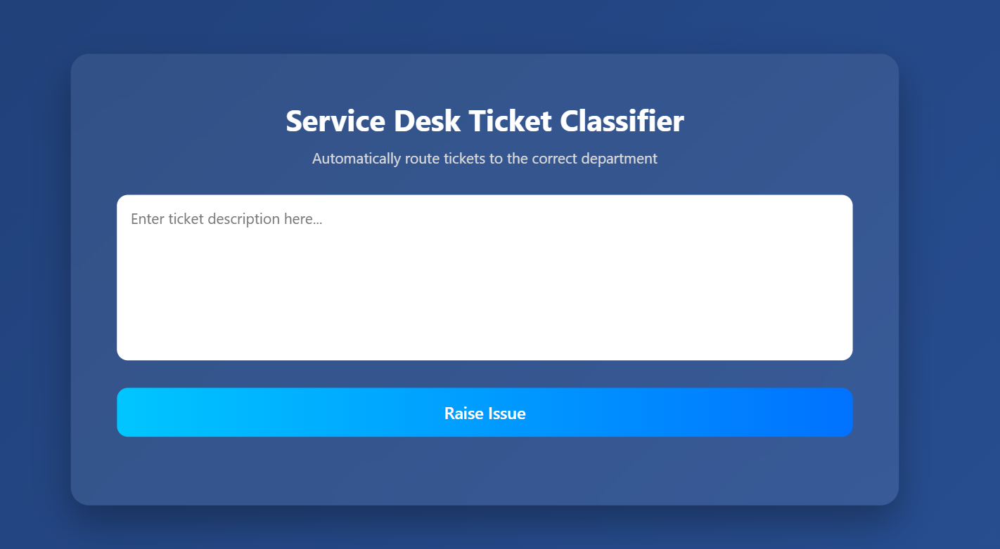
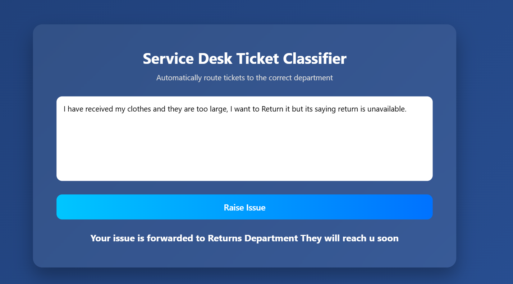

# AI Service Desk Ticket Classifier

<p align="center">
  
</p>

An AI-powered Service Desk Ticket Classification System that automatically routes customer support tickets to the appropriate department using a fine-tuned DistilBERT model. The system combines Natural Language Processing (NLP), Flask APIs, and a responsive frontend to provide real-time ticket categorization.

---

## Features

* Automatic ticket classification using DistilBERT
* REST API built with Flask
* Automatic ticket classification using DistilBERT
* REST API built with Flask
* Interactive frontend using HTML, CSS, and JavaScript
* Real-time prediction results
* Multi-department ticket routing
* End-to-end machine learning workflow

---
* Multi-department ticket routing
* End-to-end machine learning workflow

---

## Tech Stack

### Frontend

* HTML5
* CSS3
* JavaScript

### Backend

* Flask
* Flask-CORS

### Machine Learning & NLP

* DistilBERT
* Hugging Face Transformers
* PyTorch
* Scikit-Learn

---
### Frontend

* HTML5
* CSS3
* JavaScript

### Backend

* Flask
* Flask-CORS

### Machine Learning & NLP

* DistilBERT
* Hugging Face Transformers
* PyTorch
* Scikit-Learn

---

## Supported Departments

* Technical
* Billing
* Sales
* HR
* Returns
* General

---

## Project Architecture

```text
User Input
    ↓
Frontend (HTML/CSS/JavaScript)
    ↓
Fetch API Request
    ↓
Flask Backend
    ↓
DistilBERT Model
    ↓
Department Prediction
    ↓
JSON Response
    ↓
Frontend Display
```

---

## Application Interface

### Home Screen

<p align="center">
  
</p>

Users can enter a support ticket description and submit it for classification.

---

### Prediction Example

<p align="center">
  
</p>

Example:

**Input Ticket**

```text
I have received my clothes and they are too large.
I want to return them but the return option is unavailable.
```

**Predicted Department**

```text
Returns
```

---

## API Endpoint

### POST /predict

Request:

```json
{
  "text": "Cannot connect to WiFi network"
}
```

Response:

```json
{
  "department": "Technical"
}
```

---

## How To Run Locally
---

## Project Architecture

```text
User Input
    ↓
Frontend (HTML/CSS/JavaScript)
    ↓
Fetch API Request
    ↓
Flask Backend
    ↓
DistilBERT Model
    ↓
Department Prediction
    ↓
JSON Response
    ↓
Frontend Display
```

---

## Application Interface

### Home Screen

<p align="center">
  
</p>

Users can enter a support ticket description and submit it for classification.

---

### Prediction Example

<p align="center">
  
</p>

Example:

**Input Ticket**

```text
I have received my clothes and they are too large.
I want to return them but the return option is unavailable.
```

**Predicted Department**

```text
Returns
```

---

## API Endpoint

### POST /predict

Request:

```json
{
  "text": "Cannot connect to WiFi network"
}
```

Response:

```json
{
  "department": "Technical"
}
```

---

## How To Run Locally

### Backend

```bash
cd backend
pip install -r requirements.txt
python app.py
```

Server runs on:

```text
http://127.0.0.1:5000
```

Server runs on:

```text
http://127.0.0.1:5000
```

### Frontend

Open:

```text
frontend/index.html
```

using Live Server or any local web server.

---

## Project Highlights

* Fine-tuned DistilBERT model for ticket classification
* Integrated machine learning model with Flask REST APIs
* Real-time frontend-backend communication using Fetch API
* Department prediction displayed instantly to users
* Designed for scalable customer support automation

---

## Future Improvements

* Cloud deployment (AWS / Render / Azure)
* Ticket database integration
* User authentication
* Admin dashboard
* Confidence score visualization
* Ticket history management

---

## Note

The trained DistilBERT model files are not included in this repository due to GitHub file size limitations (model.safetensors > 100 MB).

Project screenshots and implementation details are provided for demonstration purposes.

---

## Author

**Dheeraj**
B.Tech Computer Science Engineering
VIT-AP University
